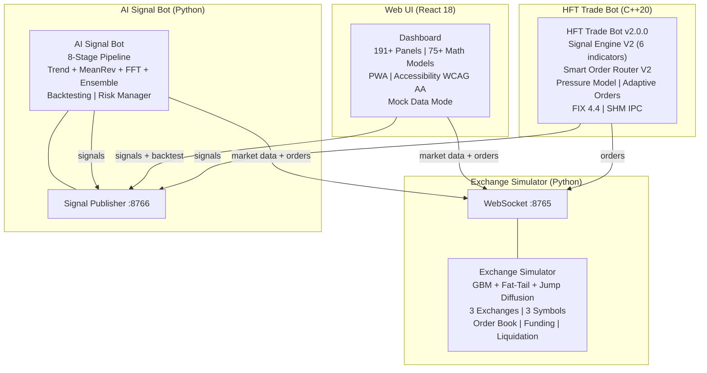

# HFT Trading System


> **An educational high-frequency trading simulator with a C++20 signal engine, 75+ advanced quantitative models, 191+ dashboard panels, FIX 4.4 protocol support, and shared-memory IPC. Zero real money, zero risk, 100% educational.**

**Live Demo:** _coming soon_ | **Documentation:** [docs/](docs/) | **Setup:** [docs/SETUP.md](docs/SETUP.md) | **Math Models:** [docs/MATH_MODELS.md](docs/MATH_MODELS.md)

---

## Architecture



---

## Features

### HFT Engine (C++20)

- **Signal Engine V2** — 6-indicator weighted composite: InlineEMA (21/50), InlineRSI (14), InlineADX (14), InlineVWAP, Order Book Imbalance, Trade Flow
- **Smart Order Router V2** — 5 strategies: BestPrice, LowestLatency, LowestFees, BestEffective, DepthAware; per-exchange EMA latency tracking; anti-toxic backoff
- **Pressure Model** — Multi-level OBI (5/10/20 + distance-weighted), toxicity detection, microprice deviation, queue position estimation, spread regime classification, price impact prediction
- **Adaptive Order Selector V2** — IOC/FOK/GTD/PostOnly dynamic selection; decision matrix: confidence x spread x OBI x toxicity; exchange-specific mappings (Binance, OKX, Bybit)
- **FIX 4.4 Protocol** — Session management, sequence numbers, heartbeat, message encoding/decoding
- **SHM IPC** — Ring buffer shared memory for signal/fill/market data channels between processes
- **Lock-free queue** — SPSC (single-producer single-consumer) for hot path
- **Cache-line alignment** — All hot-path structs `alignas(64)` to prevent false sharing
- **Latency histograms** — Per-stage p50/p95/p99/p999 tracking (signal, risk, execution, total loop)
- **Circuit breaker** — 5 errors triggers 30s cooldown, half-open probe recovery
- **Thread pinning** — CPU core affinity for execution thread
- **Object pool** — Pre-allocated, no heap allocations in hot path
- **V1 fallback** — Original signal engine preserved as configurable fallback

### Mathematical Models (75+)

| Category | Models |
|----------|--------|
| **Volatility** | GARCH(1,1), EWMA, Parkinson, Markov-Switching GARCH, Rough Volatility (rBergomi) |
| **Regime Detection** | HMM (Baum-Welch, Viterbi), Markov Chain, K-Means Clustering, Gaussian Mixture, Hopf Bifurcation |
| **Filtering** | Kalman Filter (1D/2D), Bayesian Price Predictor, Bayesian Structural Time Series |
| **Spectral** | Welch PSD, STFT, CWT, Wavelet (Haar/Daubechies), Wavelet Packet, VMD, EMD/HHT |
| **Optimal Execution** | Almgren-Chriss, Pontryagin, Stochastic Optimal Control (HJB) |
| **Risk** | VaR, CVaR, Cramer-Rao Bound, Isolation Forest, Autoencoder, VAE |
| **Causality** | Transfer Entropy, CCM (EDM), Granger via Girsanov |
| **Machine Learning** | LSTM, SVM, PCA, RKHS, Compressed Sensing, DTW |
| **Information Theory** | Renyi Entropy, Kolmogorov-Sinai, Information Bottleneck, Blahut-Arimoto |
| **Topology** | Persistent Homology, Persistent Homology Landscape, TDA |
| **Optimal Transport** | Wasserstein W1/W2, Sinkhorn, Schrodinger Bridge, Barycenters |
| **Stochastic Calculus** | Ito Generator, Malliavin Calculus, Fokker-Planck, SDE (Euler/Milstein) |
| **Network** | Graph Theory MST, Centrality, Tensor Decomposition |
| **Functional Analysis** | Sobolev Regularization, Lax-Milgram, Riesz Representation, Banach Fixed-Point |
| **Measure Theory** | Hahn Decomposition, Cameron-Martin, Radon-Nikodym, Prokhorov Metric |
| **Physics-inspired** | Renormalization Group, Free Energy Principle, Lie Group Symmetries, Burgers Equation |
| **Signal Processing** | Ehlers SuperSmoother, MAMA/FAMA, Cesaro/Fejer, Hilbert Transform |
| **Bayesian** | HMC, BOCPD, Black-Litterman, Bayesian Ridge |
| **Other** | Kelly Criterion, Copula (Clayton/Gumbel/Gaussian/Student-t), Optimal Stopping (Snell), Affine Arithmetic, Stone-Cech, Arzela-Ascoli |

### Web UI (191+ panels)

- **React.lazy code splitting** — all 191+ panels lazy-loaded with Suspense fallbacks
- **ChunkRetryBoundary** — automatic retry on chunk load failure (3 retries with backoff)
- **Preload-on-hover** — hovering a category preloads all panels in that category
- **VirtualList** — windowed list rendering for large datasets
- **ErrorBoundary** — per-panel error catching with retry button, auto-disable after 3+ errors, re-enable option
- **EmptyState component** — consistent empty/loading states across all panels (SignalFeed, BotStatus, FillsPanel, ArbitragePanel, PriceComparison, Watchlist, PositionsPanel, AccountPanel)
- **OrderForm validation** — quantity validation with visual feedback, margin exceedance warning, disabled submit on invalid input
- **SignalFeed filter** — All/Long/Short direction filter with filtered count
- **Toast notifications** — auto-dismiss with visual progress bar, 5-toast cap, role="alert" accessibility
- **Loading skeletons** — SkeletonRow, SkeletonCard, SkeletonTable, LoadingSpinner with shimmer animation
- **Dark/light theme** — CSS variables, persisted in localStorage
- **Multi-monitor** — detachable panels via popup windows with live data
- **Keyboard shortcuts** — 1/2/3 exchange, Q/W/E symbol, Space pause, A/B/S/R/P/F/H/T tab switching, ? help
- **CLI monitors** — 4 monitor scripts (signal feed, HFT status, error viewer, price tracker)
- **PWA** — installable, offline-capable via vite-plugin-pwa with Workbox caching
- **Accessibility (WCAG AA)** — ARIA roles, keyboard navigation, skip-to-content link, focus-visible rings, reduced-motion support, aria-pressed on toggles, aria-live on connection status
- **Mock data mode** — `VITE_MOCK_MODE=true` generates synthetic market data for standalone demo without backend
- **Web Worker** — heavy indicator calculations offloaded to compute.worker.js
- **Performance hooks** — useDebouncedValue, useThrottledCallback, useBatchedUpdates, useIntersectionObserver

### Exchange Simulator

- **GBM price generation** with per-symbol volatility and configurable random seed
- **Fat-tail returns** — Student-t distribution for realistic tail risk
- **Jump diffusion** — Merton model for sudden price jumps
- **Stochastic volatility** — Heston-like volatility process
- **Regime switching** — Markov-switching market regimes
- **3 simulated exchanges** (Binance, Bybit, OKX) with different fee structures and slippage
- **Realistic order book** — depth profile, spoofing detection, iceberg orders, queue position, adverse selection
- **Latency simulation** — per-exchange base latency, jitter, spikes, reconnection delay
- **Funding rates** — 8-hour intervals, perpetual-spot basis, payment calculation
- **Liquidation engine v2** — cascade liquidations, partial liquidation, liquidation price estimation, insurance fund, ADL
- **News event simulation** — sudden volatility spikes with directional bias
- **Market impact model** — large orders move price
- **Partial fill simulation** — large orders split across order book levels
- **Multi-exchange arbitrage detection** — auto-execute when spread > threshold
- **Config hot-reload** — change volatility/fees without restart
- **Data export** — CSV and Parquet formats

### AI Signal Bot

- **8-stage signal generation pipeline** (Data Collection -> Technical Analysis -> Trend Following -> Mean Reversion -> FFT Cycle -> Ensemble Voter -> Signal Validation -> Order Execution)
- **Trend Following** strategy (EMA crossover + ADX filter)
- **Mean Reversion** strategy (RSI extremes + Bollinger Bands)
- **FFT Cycle** strategy (spectral analysis, cycle detection, regime classification)
- **Ensemble Voter** (majority or confidence-weighted, 3+ strategies)
- **Statistical Arbitrage** (cointegration, Kalman hedge ratio, z-score)
- **Market Making** (Avellaneda-Stoikov, inventory skew)
- **ML Ensemble** (LightGBM, Isolation Forest, HMM regime)
- **Sentiment** (news events, pre/post-positioning)
- **Kelly Criterion position sizing** — optimal bet size from win rate and payoff ratio
- **Backtesting engine** — historical replay with fee/slippage modeling, drawdown analysis, recovery factor, Calmar ratio, multi-strategy comparison
- **Strategy parameter optimization** — grid search with walk-forward validation
- **Risk manager** — trailing stop loss, breakeven moves, partial take profit, max hold time

### Infrastructure

- **Docker Compose** — 4-service orchestration with health checks and restart policies
- **CI/CD** (GitHub Actions) — Python tests, C++ build (gcc-13 + clang-17 + MSVC Windows), JS tests + coverage, bundle analysis, Docker build, dependency audit, Netlify deploy
- **Cross-platform** — C++ engine compiles on MSVC (Windows), GCC (Linux), and Clang (macOS). Shared memory IPC auto-detects Windows (`CreateFileMappingW`) vs POSIX (`shm_open`). Python SHM uses `mmap` with `tagname` on Windows.
- **Vitest** — 60+ tests covering indicators, format utils, GARCH, Kalman, HMM, cointegration, K-Means, registry, VirtualList
- **Prometheus** — metrics endpoint on exchange simulator
- **PostgreSQL** — optional database backend
- **WebSocket compression** — per-message deflate
- **Reconnection sync** — state sync protocol (resume from last candle, replay missed signals)
- **Config hot-reload** — change parameters without restart
- **Timestamped logging** — every run creates `logs/<service>_YYYYMMDD_HHMMSS.log`
- **CSV trade logging** — every fill, SL/TP close, and arbitrage execution logged to `logs/trades_YYYYMMDD_HHMMSS.csv`

---

## Benchmarks

| Metric | Value |
|--------|-------|
| C++ signal generation (p50) | < 10 us |
| C++ signal generation (p99) | < 50 us |
| C++ total loop (p50) | < 100 us |
| WebSocket throughput | ~1,000 msg/s |
| Web UI bundle size (dist) | < 5 MB |
| Web UI initial render | < 1s |
| Test coverage | 60+ JS tests, 30+ C++ tests, 50+ Python tests |
| Panel count | 191+ registered panels |
| Math models | 75+ advanced quantitative models |
| Component files | 201+ React components |

---

## Quick Start

### Windows (one-command install + run)

```bat
REM 1. Clone the repository
git clone https://github.com/ezpectus/HFT-trading-simulator.git
cd HFT-trading-simulator

REM 2. Install all dependencies (Python + C++ + Node.js)
install-deps.bat
REM or: no-docker.bat install

REM 3. Start all services
no-docker.bat
```

Open **http://localhost:3000** in your browser.

### Linux/macOS

```bash
git clone https://github.com/ezpectus/HFT-trading-simulator.git
cd HFT-trading-simulator

# Install all dependencies
./no-docker.sh install

# Start all services
./no-docker.sh start
```

### Docker

```bash
git clone https://github.com/ezpectus/HFT-trading-simulator.git
cd HFT-trading-simulator
docker-compose up
```

Open **http://localhost:3000** in your browser.

### Mock mode (no backend needed)
```bash
cd web-ui
npm install
VITE_MOCK_MODE=true npm run dev
```

---

## Screenshots

_Screenshots will be added here._

---

## Technology Stack

| Component | Language | Key Libraries |
|-----------|----------|---------------|
| Exchange Simulator | Python 3.12 | asyncio, websockets, pyyaml, numpy |
| AI Signal Bot | Python 3.12 | asyncio, websockets, sqlite3, numpy, matplotlib |
| HFT Trade Bot | C++20 | Boost, websocketpp, spdlog, fmt, nlohmann/json, yaml-cpp |
| Web UI | JavaScript (ES2021) | React 18, Vite 5, TailwindCSS 3, lightweight-charts 4, lucide-react |
| Communication | - | WebSocket (JSON), per-message deflate, SHM IPC |
| Database | - | SQLite (WAL mode) |
| Containerization | - | Docker, docker-compose |
| CI/CD | - | GitHub Actions (Python, C++, JS, Docker, Netlify) |
| Linting | - | ruff (Python), eslint (JS), clang-format (C++) |
| Testing | - | pytest (Python), CTest (C++), Vitest (JS) |

---

## Project Structure

```
hft-trading-system/
├── exchange-simulator/              # Python: simulated crypto exchange (14 modules)
│   ├── exchange_simulator/           # Core package
│   ├── tests/                        # pytest tests
│   ├── config.yaml
│   └── Dockerfile
├── ai-signal-bot/                   # Python: AI signal generation (34 modules)
│   ├── src/                          # Source modules
│   │   ├── strategies/              # Trend, MeanRev, FFT, Ensemble, StatArb, MM, ML
│   │   ├── technical_analysis/      # RSI, EMA, MACD, BB, ATR, ADX, VWAP
│   │   ├── communication/           # WebSocket, SHM, FIX
│   │   ├── backtesting/             # Backtester, plotter, optimizer
│   │   ├── risk/                    # Risk manager, Kelly sizing
│   │   ├── signal_validation/       # Signal validator
│   │   ├── database/                # SQLite storage
│   │   └── monitoring/              # Performance tracking
│   ├── tests/                        # pytest tests
│   ├── run.py                       # Main entry point
│   └── Dockerfile
├── hft-trade-bot/                   # C++20: HFT execution engine (30+ headers)
│   ├── src/
│   │   ├── core/                    # Main loop, config, logger
│   │   ├── data/                    # Aligned types, signals
│   │   ├── strategies/              # Signal Engine V2, Pressure Model
│   │   ├── execution/               # Smart Order Router V2, Adaptive Selector
│   │   ├── communication/           # WebSocket, SHM IPC
│   │   ├── risk/                    # Risk manager
│   │   ├── position/                # Position manager
│   │   ├── fix/                     # FIX 4.4 protocol
│   │   └── utils/                   # Low-latency primitives
│   ├── tests/                       # C++ unit tests (30+)
│   ├── config/config.yaml
│   ├── CMakeLists.txt
│   └── Dockerfile
├── web-ui/                          # React 18: browser dashboard (201+ files)
│   ├── src/
│   │   ├── components/              # 191+ UI components (React.lazy)
│   │   ├── test/                    # Vitest test suite (60+ tests)
│   │   ├── panels/                  # Panel registry + container
│   │   ├── hooks/                   # WebSocket, exchange, signals, theme, performance
│   │   └── utils/                   # Indicators, performance, format, mock data
│   ├── public/                      # Favicon, PWA icons
│   ├── .env.example
│   ├── netlify.toml
│   ├── Dockerfile
│   └── package.json
├── run_logger.py                    # Shared timestamped run logging
├── trade_csv_logger.py              # Shared CSV trade logging
├── logs/                            # Runtime logs + CSV trades (gitignored)
├── docker-compose.yml               # 4-service orchestration (development)
├── docker-compose.prod.yml          # Production: 4 services + PostgreSQL + Redis + Prometheus + Grafana
├── shared_config.yaml               # Global settings
├── Makefile                         # install, dev, test, lint, build, docker, logs
├── Makefile.prod                    # Production: prod-up, prod-down, prod-build, prod-logs, prod-health
├── install-deps.bat                 # One-command dependency installer (Python + C++ + Node)
├── no-docker.bat / no-docker.sh     # Start all 4 services without Docker (Windows + Linux)
├── docker.bat / docker.sh           # Production Docker management (up, down, build, logs, ps)
├── start.bat / start.sh             # Quick-start scripts (8 windows: 4 services + 4 monitors)
├── .env.prod.example                # Production environment template
├── monitoring/                      # Prometheus config + Grafana dashboards
├── .editorconfig
├── .gitignore
├── docs/                            # Documentation (8 files)
├── .github/                         # CI workflows + issue/PR templates
├── CONTRIBUTING.md
├── README.md
└── LICENSE
```

---

## Production Deployment

The project includes a full production Docker Compose setup with monitoring:

```bash
# Copy and edit production environment
cp .env.prod.example .env.prod
# Edit .env.prod with your API keys and passwords

# Start all production services
docker.bat up
# or: make -f Makefile.prod prod-up
```

Production services:

| Service | Port | Description |
|---------|------|-------------|
| Web UI | http://localhost:3000 | React dashboard |
| Grafana | http://localhost:3001 | Monitoring dashboards |
| Prometheus | http://localhost:9090 | Metrics scraping |
| Exchange Simulator | ws://localhost:8765 | Market data feed |
| AI Signal Bot | ws://localhost:8766 | Signal publisher |
| PostgreSQL | localhost:5432 | Trade/signal persistence |
| Redis | localhost:6379 | Caching layer |

See [Makefile.prod](Makefile.prod) for all production commands.

---

## Makefile Commands

| Command | Description |
|---------|-------------|
| `make install` | Install all Python + Node dependencies |
| `make dev` | Start all services via Docker Compose |
| `make dev-exchange` | Start only exchange simulator (headless) |
| `make dev-signals` | Start only AI signal bot |
| `make dev-ui` | Start only Web UI (development mode) |
| `make test` | Run all tests (Python + JS) |
| `make test-exchange` | Run exchange simulator tests only |
| `make test-signals` | Run AI signal bot tests only |
| `make test-js` | Run JS tests with coverage |
| `make lint` | Run linters on all code (ruff + eslint) |
| `make build` | Build Web UI for production |
| `make docker-up` | Build and start all Docker containers |
| `make docker-down` | Stop all Docker containers |
| `make clean` | Remove build artifacts and caches |
| `make logs` | View latest log files for all services |

---

## CLI Monitor Windows

`start.bat` (Windows) and `start.sh` (Linux) open 8 terminal windows:

### Service Windows (4)

| # | Window | Description |
|---|--------|-------------|
| 1 | Exchange Simulator | Python exchange engine (ws://localhost:8765) |
| 2 | AI Signal Bot | Python signal bot with dashboard (ws://localhost:8766) |
| 3 | HFT Trade Bot | C++ HFT engine (requires build) |
| 4 | Web UI | Vite dev server (http://localhost:3000) |

### Monitor Windows (4)

| # | Window | Script | Description |
|---|--------|--------|-------------|
| 5 | AI Signal Bot Monitor | `ai-signal-bot/monitor.py` | Live signal feed via WS, bot log tail, signal history |
| 6 | HFT Trade Bot Monitor | `hft-trade-bot/monitor.py` | C++ process status, log tail with color-coded errors/warnings |
| 7 | Error Monitor | `error_monitor.py` | Unified error+warning viewer across all 3 service logs |
| 8 | Price & Signal Monitor | `price_monitor.py` | Live crypto prices (exchange WS) + trading signals (signal WS) + recent fills |

---

## Logging

Every service start creates a **timestamped log file** in the `logs/` directory.

| Service | Log pattern | Latest file |
|---------|------------|-------------|
| Exchange Simulator | `logs/exchange_simulator_YYYYMMDD_HHMMSS.log` | `logs/exchange_simulator_latest.log` |
| AI Signal Bot | `logs/ai_signal_bot_YYYYMMDD_HHMMSS.log` | `logs/ai_signal_bot_latest.log` |
| HFT Trade Bot | `logs/hft_trade_bot_YYYYMMDD_HHMMSS.log` | `logs/hft_trade_bot_latest.log` |

**CSV trade log:** `logs/trades_YYYYMMDD_HHMMSS.csv` — every fill, SL/TP close, and arbitrage execution.

```bash
make logs          # View latest logs for all services
cat logs/trades_latest.csv | column -t -s,   # View latest trades
```

---

## Documentation

| Document | Description |
|----------|-------------|
| [Architecture](docs/ARCHITECTURE.md) | System design, component overview, data flow, C++ V2 engine |
| [Trading Strategies](docs/TRADING_STRATEGIES.md) | All strategies, HFT V2 engine, pressure model, routing |
| [WebSocket Protocol](docs/WEBSOCKET_PROTOCOL.md) | All message types, v2 schema, compression, reconnection |
| [Web UI](docs/WEB_UI.md) | 191+ panels, performance, testing, accessibility, PWA |
| [Exchange Simulator](docs/EXCHANGE_SIMULATOR.md) | Price generation, order book, liquidation engine |
| [Setup Guide](docs/SETUP.md) | Installation, mock mode, troubleshooting |
| [Mathematical Models](docs/MATH_MODELS.md) | Detailed breakdown of all 75+ quant models with formulas and file references |
| [Changelog](docs/CHANGELOG.md) | Version history and notable changes |

---

## Configuration

Each component has its own YAML config file:

| Component | Config |
|-----------|--------|
| Exchange Simulator | [`exchange-simulator/config.yaml`](exchange-simulator/config.yaml) |
| AI Signal Bot | [`ai-signal-bot/config/settings.yaml`](ai-signal-bot/config/settings.yaml) |
| HFT Trade Bot | [`hft-trade-bot/config/config.yaml`](hft-trade-bot/config/config.yaml) |
| Shared | [`shared_config.yaml`](shared_config.yaml) |

---

## Contributing

See [CONTRIBUTING.md](CONTRIBUTING.md) for development setup, code style, testing instructions, and pull request guidelines.

---

## HFT Skills — AI Knowledge Base

This project includes [`hft-skills/`](hft-skills/README.md) — a library of **538+ production-grade skills** for AI agents working on HFT systems. Skills cover 7 domains:

| Domain | Skills | Focus |
|--------|--------|-------|
| `coding-skills/` | 15 | Clean Code, SOLID, DDD, Microservices, Testing |
| `skills/` | 152 | Lock-free queues, SHM IPC, WebSocket, FIX, SIMD, CUDA |
| `patterns/` | 94 | GoF, Distributed, Resilience, SDLC patterns |
| `quant-models/` | 95 | Black-Scholes, Heston, GARCH, Kalman, Almgren-Chriss |
| `math-models/` | 124 | Stochastic calculus, SDEs, Gaussian processes, HJB |
| `algorithms/` | 48 | VWAP/TWAP, Smart Order Router, Market Making, Arbitrage |
| `audit/` | 10 | Concurrency, Memory safety, Latency, Security audits |

Each skill follows the [agentskills.io](https://agentskills.io) standard with YAML frontmatter for fast discovery. Compatible with Claude Code, Cursor, Windsurf, GitHub Copilot, and any MCP-compatible agent.

---

## Troubleshooting

### WebSocket connection refused
- Ensure exchange simulator is running first: `python -m exchange_simulator --no-visualizer`
- Check ports 8765 (exchange) and 8766 (signals) are not in use

### Web UI shows no data
- Check WebSocket status indicators in the header (green = connected)
- Try mock mode: `VITE_MOCK_MODE=true npm run dev`
- WebSocket uses exponential backoff for reconnection

### C++ build fails
- Install dependencies: `sudo apt-get install cmake libboost-dev libboost-system-dev libssl-dev libwebsocketpp-dev libspdlog-dev libfmt-dev nlohmann-json3-dev libyaml-cpp-dev`
- Ensure C++20 compatible compiler (GCC 13+, Clang 17+)

### Chunk load failure (Web UI)
- ChunkRetryBoundary auto-retries 3 times with backoff
- Clear browser cache or hard refresh

### SHM permission denied
- Ensure `/dev/shm` is writable (Docker: `--shm-size=256m`)

### FIX port conflicts
- Default FIX port is 8767; check no other process is using it

---

## Disclaimer

This is a **paper trading simulator** for educational purposes. No real exchange API is used, no real money is involved, and no financial advice is provided. All market data is synthetically generated.

---

## License

**Apache License 2.0.** See [LICENSE](LICENSE)

This is **not** financial advice. This is **not** a trading bot for real exchanges. No real money is involved.
