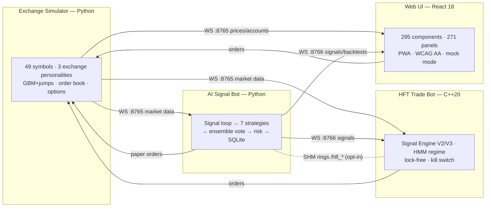

# HFT Trading System


[](https://codecov.io/gh/ezpectus/HFT-TradeBot--Lite-version)


Educational high-frequency trading simulator v2.2.0. C++20 signal engine, Python quant models, shared-memory IPC. Zero real money — 100% for learning.

---

## Architecture


```mermaid
flowchart LR
    subgraph SIM["Exchange Simulator — Python"]
        ES["49 symbols · 3 exchange personalities<br/>GBM+jumps · order book · options"]
    end
    subgraph BOT["AI Signal Bot — Python"]
        AI["Signal loop → 7 strategies<br/>→ ensemble vote → risk → SQLite"]
    end
    subgraph HFT["HFT Trade Bot — C++20"]
        CPP["Signal Engine V2/V3 · HMM regime<br/>lock-free · kill switch"]
    end
    subgraph UI["Web UI — React 18"]
        WEB["295 components · 271 panels<br/>PWA · WCAG AA · mock mode"]
    end

    ES -- "WS :8765 market data" --> AI
    ES -- "WS :8765 market data" --> CPP
    ES -- "WS :8765 prices/accounts" --> WEB
    AI -- "WS :8766 signals" --> CPP
    AI -- "WS :8766 signals/backtests" --> WEB
    AI -- "paper orders" --> ES
    CPP -- "orders" --> ES
    WEB -- "orders" --> ES
    AI -. "SHM rings /hft_* (opt-in)" .- CPP
```

Health/metrics endpoints: sim `:8775`, AI bot `:8080` (probes) + `:9090` (metrics), HFT bot `:9091`, UI `:3000`.

### Why Three Languages?

| Language | Role | Why |
|----------|------|-----|
| **Python** | Signal bot, exchange simulator | ML ecosystem (scikit-learn, optional lightgbm/xgboost). 50ms latency acceptable for signal generation. |
| **C++20** | HFT execution engine | Sub-millisecond loop. Zero-allocation hot path, lock-free queues, cache-line alignment. |

### Latency Budget

```
Exchange → [WS 2ms] → Signal Bot → [SHM 30us] → C++ Bot → [WS] → Exchange
C++ main loop: 1ms (configurable)
```

---

## Quick Start

### Windows
```bat
git clone https://github.com/ezpectus/HFT-TradeBot--Lite-version.git
cd HFT-TradeBot--Lite-version
install-deps.bat
no-docker.bat
```

### Linux/macOS
```bash
git clone https://github.com/ezpectus/HFT-TradeBot--Lite-version.git
cd HFT-TradeBot--Lite-version
./no-docker.sh install
./no-docker.sh start
```

### Docker
```bash
docker compose up
```

### Mock mode (no backend)
```bash
cd web-ui && npm install
VITE_MOCK_MODE=true npm run dev
```

Open **http://localhost:3000**.

---

## Components

### Exchange Simulator (Python)
- GBM price generation with per-symbol volatility
- Microstructure models: Student-t, Merton jumps, Heston SV, Markov regime switching
- 49 crypto symbols, 3 exchanges (Binance, Bybit, OKX) with different fees
- Order book with depth, partial fills, slippage, market impact
- Options pricing (Black-Scholes, Binomial Tree, Greeks)
- Advanced orders: Stop-Limit, Trailing Stop, OCO, Iceberg
- Funding rates, liquidation engine, multi-exchange arbitrage detection

### AI Signal Bot (Python)
- Signal loop: data collection → technical analysis → strategies → validation → publish
- 7 wired strategies: Trend, MeanReversion, FFT, StatArb, MarketMaking, Sentiment, MLEnsemble
- Backtesting engine with walk-forward validation
- Risk management: VaR, CVaR, Kelly criterion, stress tests
- Portfolio optimization: Markowitz, Black-Litterman, risk parity

### HFT Trade Bot (C++20)
- Signal Engine V2: 6-indicator weighted composite (EMA, RSI, ADX, VWAP, OBI, Pressure)
- Signal Engine V3: HMM regime detection with online Baum-Welch, Viterbi decoding
- Lock-free SPSC queue, cache-line alignment (`alignas(64)`)
- SHM IPC for zero-copy Python ↔ C++ communication
- Direct WebSocket order execution to the configured exchange

### Web UI (React 18)
- 295 component files, 271 registered panels (278 registry ids incl. 7 category rows) with React.lazy code splitting
- Dark/light/auto theme, PWA, WCAG AA accessibility
- Backtest comparison, session replay, strategy competition
- Real-time WebSocket data, mock mode for standalone demo
- ~158 test files (Vitest), 4 E2E specs (Playwright)

---

## Feature Status

What's real, what's a demo, what's dormant — verified against the code:

| Status | Feature |
|--------|---------|
| **Working** | Exchange simulator (market data, order matching, funding, liquidation), paper trading, 7 strategies + ensemble, backtesting + walk-forward, C++ signal engines V2/V3, risk manager, all health/metrics endpoints, Prometheus metrics + 22 alert rules → Alertmanager + Grafana dashboards |
| **Working, opt-in** | SHM IPC rings (`/hft_signals`, `/hft_fills`, `/hft_kill_switch`) — `shm.enabled: false` by default, enable when the C++ bot runs on the same host |
| **Demo / educational** | ~60 math-model UI panels (visualizations, not wired to trading), mock mode (`VITE_MOCK_MODE=true`), exchange-themed UI clones, strategy competition |
| **Dormant** | Live-trading path: `paper_trading: false` + `EXCHANGE_API_KEY`/`EXCHANGE_API_SECRET` + `pip install ccxt` → real orders via `RealExchangeAdapter` (ccxt). Off by default, untested — not recommended |
| **Removed** | Real price feeds, Rust FFI executor, PostgreSQL/Redis, Terraform, research/ML modules (see `docs/theory/` for the deletion rationale) |

---

## Technology Stack

| Component | Language | Key Libraries |
|-----------|----------|---------------|
| Exchange Simulator | Python 3.12 | asyncio, websockets, numpy, orjson, msgpack |
| AI Signal Bot | Python 3.12 | asyncio, websockets, numpy, aiohttp, prometheus-client (optional: sklearn, lightgbm, xgboost, scipy) |
| HFT Trade Bot | C++20 | Boost, websocketpp, spdlog, fmt, nlohmann/json |
| Web UI | JS (ES2021) | React 18, Vite, TailwindCSS, lightweight-charts |
| Communication | — | WebSocket, SHM IPC |
| Database | — | SQLite (WAL mode) |
| CI/CD | — | GitHub Actions (Python, C++, JS, Docker) |
| Testing | — | pytest, CTest/doctest, Vitest, Playwright |

---

## Documentation

| Document | Description |
|----------|-------------|
| [Architecture](docs/ARCHITECTURE.md) | System design, component overview, data flow |
| [Quick Start](docs/guides/QUICK_START.md) | Get running in 5 minutes |
| [Trading Guide](docs/guides/TRADING_GUIDE.md) | Orders, positions, strategies, risk |
| [Development Guide](docs/guides/DEVELOPMENT_GUIDE.md) | Setup, architecture, testing, standards |
| [Configuration](docs/guides/CONFIGURATION_GUIDE.md) | All configuration options |
| [Trading Strategies](docs/TRADING_STRATEGIES.md) | All strategies, HFT engine, routing |
| [REST API](docs/REST_API.md) | REST API reference |
| [WebSocket Protocol](docs/WEBSOCKET_PROTOCOL.md) | Message types, schema, reconnection |
| [Web UI](docs/WEB_UI.md) | Panels, performance, accessibility |
| [Advanced Orders](docs/ADVANCED_ORDER_TYPES.md) | Iceberg, TWAP, trailing stops, OCO |
| [Risk Management](docs/RISK_MANAGEMENT.md) | VaR, CVaR, Kelly, stress testing |
| [Monitoring](docs/MONITORING_GUIDE.md) | Prometheus, Grafana, alert rules |
| [Testing](docs/TESTING.md) | Test infrastructure and coverage |
| [Deployment](docs/DEPLOYMENT.md) | Deployment procedures |
| [Performance](docs/PERFORMANCE.md) | Latency targets and benchmarks |
| [Audit Findings](docs/AUDIT_FINDINGS.md) | Full grep-based code audit |
| [Project Audit](PROJECT_AUDIT.md) | Comprehensive project audit |
| [Contributing](CONTRIBUTING.md) | Setup, testing, code style, CI/CD |
| [Security](SECURITY.md) | Security policy and measures |

---

## Project Structure

```
hft-trading-system/
├── exchange_simulator/          # Python: simulated crypto exchange
├── ai-signal-bot/               # Python: AI signal generation (60+ modules)
│   ├── src/
│   │   ├── strategies/          # 7 wired trading strategies
│   │   ├── technical_analysis/  # Indicators, FFT, Hawkes, Kalman, etc.
│   │   ├── backtesting/         # Backtester, optimizer, walk-forward
│   │   ├── risk/                # VaR, CVaR, Kelly, stress tests
│   │   ├── portfolio/           # Markowitz, BL, risk parity
│   │   └── communication/       # WebSocket, SHM
│   └── tests/
├── hft-trade-bot/               # C++20: HFT execution engine
├── web-ui/                      # React 18: dashboard (295 components, ~158 test files)
├── docs/                        # 13 documentation files + 4 guides + 8 theory docs
├── monitoring/                  # Prometheus + Alertmanager + Grafana config
├── docker-compose.yml           # Development
├── docker-compose.prod.yml      # Production (+ Prometheus, Alertmanager, Grafana)
└── shared_config.yaml           # Canonical cross-component config reference (enforced by scripts/test_config_consistency.py)
```

---

## Configuration

| Component | Config file |
|-----------|------------|
| Exchange Simulator | `exchange_simulator/config.yaml` |
| AI Signal Bot | `ai-signal-bot/config/settings.yaml` |
| HFT Trade Bot | `hft-trade-bot/config/config.yaml` |
| Shared | `shared_config.yaml` |

Key defaults: 49 symbols, 5m timeframe, 60s signal interval, 2% risk per trade, 8% daily drawdown limit, 65% min confidence, paper trading mode.

---

## Production Deployment

```bash
cp .env.prod.example .env.prod
# Edit .env.prod with your settings
docker compose -f docker-compose.prod.yml up -d
```

| Service | Port | Description |
|---------|------|-------------|
| Web UI | 3000 | React dashboard + `/health` endpoint |
| Grafana | 3001 | Monitoring dashboards |
| Exchange Simulator | 8765 | Market data (WebSocket) |
| Exchange Simulator | 8775 | Health (`/health`, `/live`, `/ready`) + `/metrics` |
| AI Signal Bot | 8766 | Signal publisher (WebSocket) |
| AI Signal Bot | 9092 | Prometheus metrics + `/health` (container-internal 9090) |
| HFT Trade Bot | 9091 | Health + metrics |
| AI Signal Bot | 8080 | Health server — `/live`, `/ready`, `/health/*` detail endpoints |
| Prometheus | 9090 | Internal only (`expose`); dev compose maps it to 9099 |
| Alertmanager | 9093 | Alert routing/grouping (dev compose); internal `expose` in prod |

---

## Reliability & Health Checks

All services expose HTTP health endpoints for Docker/Kubernetes probes:

| Service | Endpoint | Check |
|---------|----------|-------|
| Exchange Simulator | `GET :8775/health` | Status, clients, trading_active |
| Exchange Simulator | `GET :8775/live` | Liveness (always 200 if running) |
| Exchange Simulator | `GET :8775/ready` | Readiness (200 if trading active) |
| AI Signal Bot | `GET :8080/health` | Liveness + readiness checks |
| AI Signal Bot | `GET :9090/health` | Simple health OK |
| HFT Trade Bot | `GET :9091/health` | C++ health server |
| Web UI | `GET :3000/health` | Static nginx health |

**Graceful shutdown:** Both AI Signal Bot and Exchange Simulator handle SIGTERM/SIGINT — clean shutdown of WebSocket connections, background tasks, metrics servers, and tracing.

**WebSocket reconnection:** Exponential backoff (1s → 60s max) with jitter (±25%), automatic reconnect on `ConnectionClosed`/`OSError`.

**Docker Compose:** All 3 compose files use HTTP healthchecks. **Helm:** `httpGet` liveness/readiness probes (not `tcpSocket`).

See [Monitoring Guide](docs/MONITORING_GUIDE.md) for full details.

---

## Troubleshooting

| Problem | Solution |
|---------|----------|
| WebSocket connection refused | Start exchange simulator first: `python -m exchange_simulator --no-visualizer` |
| Web UI shows no data | Check WS status indicators, try `VITE_MOCK_MODE=true npm run dev` |
| C++ build fails | Install Boost, websocketpp, spdlog, fmt, nlohmann-json, yaml-cpp. Need C++20 compiler. |
| SHM permission denied | Ensure `/dev/shm` writable. Docker: `--shm-size=256m` |

---

## Disclaimer

**Paper trading simulator for educational purposes.** All market data is synthetically generated; the default `paper_trading: true` mode never leaves the simulator. A dormant opt-in live-trading adapter exists (`paper_trading: false` + ccxt + `EXCHANGE_API_KEY`) — it is untested, off by default, and entirely at your own risk. No financial advice.

## License

Apache License 2.0. See [LICENSE](LICENSE).
