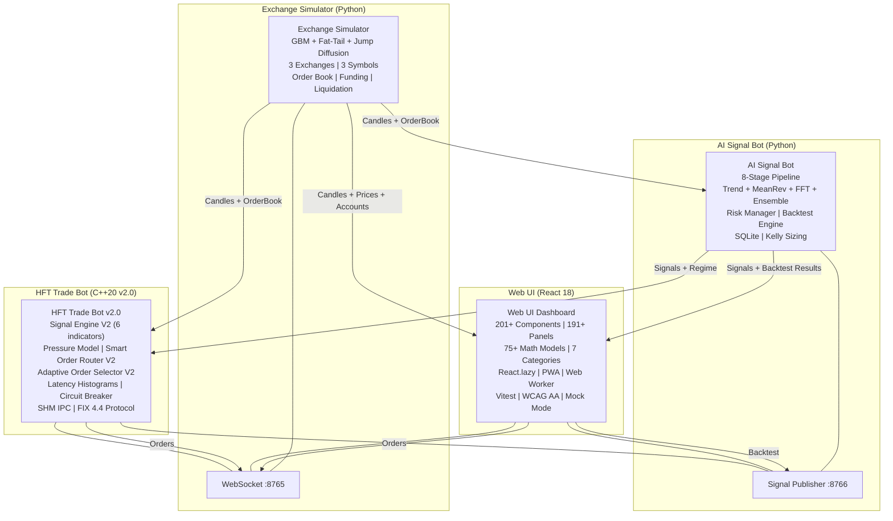

# Architecture

## Overview

The system is a full-stack crypto HFT trading simulation platform consisting of four independent components communicating over WebSocket. It has evolved through 41 development phases to include a C++20 sub-millisecond signal engine, 201+ React components, 191+ registered UI panels, 75+ advanced mathematical models, PWA support, and production-grade infrastructure with PostgreSQL, Redis, Prometheus, and Grafana. The codebase has been optimized across 10 rounds (34 optimizations, 23 walkthrough examples in [PERFORMANCE.md](PERFORMANCE.md)) covering C++ hot paths (precomputed Wilder's smoothing, single-pass OBI, transparent hash, unordered_set lookups) and Python hot paths (orjson, asyncio.gather, deque, dict/set lookups).



## Components

### 1. Exchange Simulator (`exchange_simulator/`)

**Language:** Python 3.12+
**Role:** Simulates 3 crypto exchanges with realistic market microstructure

| Feature | Implementation |
|---------|---------------|
| Price generation | GBM with per-symbol volatility, fat-tail jumps, news event spikes |
| Exchanges | Binance, Bybit, OKX (different fees, slippage, volatility multipliers) |
| Symbols | BTC/USDT, ETH/USDT, SOL/USDT |
| Order book | 20 levels per side, decay-based liquidity, real-time depth |
| Order matching | Market and limit orders with slippage, partial fills, market impact |
| Account | Balance, positions, PnL, win rate, margin, leverage |
| Arbitrage | Multi-exchange spread detection, auto-execution, WebSocket broadcast |
| Funding rates | Per-exchange, charged every 8h equivalent (96 candles) |
| Liquidation | Auto-close when margin < maintenance level, partial liquidation (50%), insurance fund, cascade liquidations, auto-deleveraging (ADL) |
| News events | Sudden volatility spikes with directional bias |
| Config hot-reload | Change volatility/fees without restart |
| Simulation speed | Pause / 1x / 2x / 5x via WebSocket command |
| Data export | CSV and Parquet formats (candles, orders, accounts, positions) |
| CSV trade logging | Every fill, SL/TP close, arbitrage execution logged to timestamped CSV |
| Timestamped logging | Per-run log files in `logs/` with `_latest.log` symlink |
| Visualizer | Terminal-based candle charts, RSI, MACD, BB, FFT regime, equity sparkline |
| Data feed | WebSocket server streaming candles, order books, accounts, fills |
| Market microstructure | Heston stochastic volatility, Student-t fat tails, Merton jump diffusion, Markov regime switching (CALM/VOLATILE/CRASH/RECOVERY), U-shaped intraday volume |
| Latency simulation | Per-exchange base latency (Binance 50ms, OKX 80ms, Bybit 120ms), Gaussian jitter, Poisson spikes, exponential backoff reconnection |
| Order book realism | Power-law depth profiles, spoofing detection, iceberg orders, FIFO queue positions, adverse selection (toxic flow score) |
| Funding rate history | Per-exchange funding rate tracking with history deque, visualization in Web UI |
| Depth snapshot API | Cumulative bid/ask volumes, imbalance, spread, level-by-level depth data |
| Health check | Aggregated health endpoint across all services (/health, /healthz) |
| Spread analytics | Per-exchange/symbol spread tracking with P50/P90/P99 percentiles, effective slippage measurement in basis points |

**Key files:**
- `market_simulator.py` — GBM price engine with volatility multipliers
- `exchange.py` — Order matching, account management, slippage, market impact
- `visualizer.py` — Terminal dashboard with ASCII charts and sparklines
- `websocket_server.py` — WebSocket data feed, arbitrage auto-execution, CSV trade logging
- `models.py` — Data structures (Candle, Order, Position, Account, ClosedTrade)
- `arbitrage.py` — Multi-exchange arbitrage detection
- `config_validator.py` — Config validation with comprehensive error checking
- `data_export.py` — CSV/Parquet data export
- `liquidation_engine_v2.py` — Cascade liquidations, partial liquidation, insurance fund, ADL
- `market_microstructure.py` — Heston stochastic vol, Student-t returns, Merton jumps, Markov regime switching
- `latency_simulation.py` — Per-exchange latency simulation with jitter, spikes, reconnection backoff
- `order_book_realism.py` — Realistic L2 order book with spoofing, icebergs, queue positions, adverse selection
- `funding_rate.py` — Funding rate calculation and history tracking
- `spread_analytics.py` — Bid-ask spread tracking, percentile statistics, effective slippage measurement
- `__main__.py` — Entry point with timestamped logging via `run_logger.py`

### 2. AI Signal Bot (`ai-signal-bot/`)

**Language:** Python 3.12+
**Role:** Analyzes market data and generates trading signals with risk management

**Pipeline (8 stages):**

1. **Data Collection** — Receives candle + order book data via WebSocket
2. **Technical Analysis** — Computes RSI, EMA, SMA, MACD, Bollinger Bands, ATR, ADX, VWAP
3. **Trend Following** — EMA crossover + ADX strength filter
4. **Mean Reversion** — RSI extremes + Bollinger Band touches
5. **FFT Cycle Strategy** — Spectral analysis, cycle detection, regime classification (TRENDING/RANGING/MIXED)
6. **Ensemble Voter** — Majority or confidence-weighted voting (3 strategies)
7. **Signal Validation** — Confidence, R:R ratio, drawdown, position limits
8. **Order Execution** — Sends orders to exchange simulator

**Additional features:**
- Risk Manager: trailing stop (fixed % or ATR-based), breakeven moves, partial take profit, max hold time
- Backtesting engine with fee/slippage modeling, drawdown analysis, Calmar ratio
- Strategy parameter optimization with grid search and walk-forward validation
- Kelly Criterion position sizing (half-Kelly default, confidence-scaled)
- Order book replay for backtesting OBI/pressure strategies
- Backtest WebSocket endpoint (run backtests from Web UI)
- CSV logging for signals and trades
- Timestamped file logging via `run_logger.py`
- CLI monitor script (`monitor.py`) for live signal feed
- Circuit breaker: signal protection with CLOSED/OPEN/HALF_OPEN states, consecutive failure threshold, cooldown, probe recovery
- Prometheus metrics server: counters (signals sent/blocked, backtests, circuit breaker trips) and gauges (WS clients, CB state, uptime) on `:9091/metrics`
- Health aggregator: aggregated health endpoint across all services on `:9092/health` and `/healthz`
- SHM IPC: lock-free SPSC ring buffer for Python ↔ C++ communication (signal producer, fill consumer, market data writer)
- FIX protocol client: order execution via FIX 4.2 protocol with session management

**Key files:**
- `src/technical_analysis/indicators.py` — All TA indicators
- `src/strategies/strategies.py` — Trend following, mean reversion, ensemble
- `src/strategies/fft_strategy.py` — FFT cycle detection and regime classification
- `src/signal_validation/validator.py` — Risk-based signal filtering
- `src/communication/ws_client.py` — WebSocket client for exchange
- `src/communication/signal_publisher.py` — WebSocket server for signals + backtest endpoint
- `src/communication/circuit_breaker.py` — Signal protection with CLOSED/OPEN/HALF_OPEN states, failure threshold, cooldown
- `src/communication/metrics_server.py` — Prometheus metrics endpoint on `:9091/metrics`
- `src/communication/health_check.py` — Aggregated health endpoint on `:9092/health`
- `src/communication/shm_ring_buffer.py` — Lock-free SPSC shared memory ring buffer for Python ↔ C++ IPC
- `src/communication/shm_signal_producer.py` — SHM producer for signal messages to C++
- `src/communication/shm_fill_consumer.py` — SHM consumer for fill messages from C++
- `src/communication/shm_market_data_writer.py` — SHM writer for market data snapshots
- `src/communication/fix_client.py` — FIX 4.2 protocol client for order execution
- `src/database/db.py` — SQLite storage (WAL mode)
- `src/monitoring/tracker.py` — Performance tracking and dashboard
- `src/risk/risk_manager.py` — Trailing stop, breakeven, partial TP, max hold time
- `src/risk/kelly.py` — Kelly Criterion position sizing
- `src/backtesting/backtester.py` — Backtesting engine with fee/slippage modeling
- `src/backtesting/order_book_replay.py` — Order book replay for OBI backtesting
- `src/backtesting/optimizer.py` — Strategy parameter optimization with grid search
- `src/backtesting/plotter.py` — Matplotlib equity curve plotting
- `run.py` — Main entry point with timestamped logging
- `run_backtest.py` — CLI backtest runner with plotting and optimization
- `monitor.py` — CLI monitor for live signal feed

### 3. HFT Trade Bot (`hft-trade-bot/`)

**Language:** C++20 (GCC 13+ / Clang 17+ / MSVC 19.50+)
**Role:** Sub-millisecond execution engine with native signal generation

**V2 Architecture:**

The HFT bot was upgraded to v2.0.0 with a complete latency optimization overhaul and native C++ signal engine. The V1 engine is preserved as a configurable fallback.

**Dual signal path:**
- **Fast path (< 1ms):** Signal Engine V2 (6 inline indicators, stack-allocated, no heap allocations)
- **Slow path:** Receives AI signals from Python bot via WebSocket :8766

**V2 Subsystems:**

| Subsystem | Description |
|-----------|-------------|
| Signal Engine V2 | 6-indicator weighted composite: InlineEMA(21/50) 0.25, InlineRSI(14) 0.15, OBI(5/10/20) 0.20, VWAP deviation 0.10, InlineADX(14) 0.10, Pressure 0.20 |
| Pressure Model | Multi-level OBI, trade flow imbalance, toxicity detection, microprice, queue position, spread regime, price impact prediction |
| Smart Order Router V2 | IExchange interface (DIP/SOLID), 5 strategies: BestPrice, LowestLatency, LowestFees, BestEffective, DepthAware. Anti-toxic backoff, per-exchange latency tracking |
| Adaptive Order Selector V2 | Dynamic IOC/FOK/GTD/PostOnly based on confidence, spread, OBI, toxicity. Exchange-specific mappings for Binance, OKX, Bybit |
| Latency Infrastructure | Spinlock, SPSCQueue (lock-free), ObjectPool (no heap alloc), LatencyHistogram (P50/P95/P99/P99.9), ScopedLatency (RAII), ThreadAffinity, CircuitBreaker, RetryPolicy |
| Cache-Line Alignment | All hot-path structs `alignas(64)`: AlignedOrderBookLevel, FastSignal, FastOrder, PressureResult, RoutingDecision |
| Dynamic Leverage | Confidence >= 85 + ADX > 30 -> 5x, >= 75 -> 3x, else 1x |
| Graceful Shutdown | Cancel all open positions before exit, latency report logging |
| V1 Fallback | Configurable via `signal_engine_v2_enabled` flag |
| Momentum Breakout V2 | Multi-timeframe EMA stack (9/21/50/200) with slope detection, volume confirmation (1.5x avg), ATR-based breakout levels, ADX-gated (ADX > 25), confidence scoring |
| Market Making V2 | Avellaneda-Stoikov model: reservation price, optimal spread, inventory-skewed quotes, EWMA volatility, adverse selection protection (toxicity cancel), max inventory caps |
| Statistical Arbitrage V2 | Cointegration-based pair trading: Engle-Granger OLS regression, Kalman filter adaptive hedge ratio, z-score entry/exit, stop-loss on spread divergence, multi-pair correlation matrix |
| Risk Infrastructure | KillSwitch (file/programmatic/daily-loss triggers, SHM notification, order blocking), PreTradeRisk (token bucket rate limiter, blacklist/whitelist, position/exposure/loss limits, margin buffer check), PortfolioRisk (historical & parametric VaR, CVaR, stress scenarios, drawdown tracker, correlation-adjusted exposure) |

**Compiler flags:** GCC/Clang: `-O3`, `-flto` (LTO), `-msse4.2`, `-ffast-math`, `-finline-functions`. MSVC: `/O2`, `/GL` (LTO), `/utf-8`, `NOMINMAX` (prevents min/max macro pollution).

**Cross-platform SHM IPC:** All shared memory headers auto-detect platform via `#ifdef _WIN32`. Windows uses `CreateFileMappingW`/`MapViewOfFile` (page-file-backed). POSIX uses `shm_open`/`mmap` (`/dev/shm`). Python side uses `mmap.mmap(-1, size, tagname=...)` on Windows. Struct packing enforced via `#pragma pack(push, 1)` to match Python `struct` layout on MSVC.

**SHM IPC Protocol (`shm_protocol.h`):**

Four binary message types for Python ↔ C++ communication. All structs use `#pragma pack(push, 1)` for cross-language alignment. Python equivalents use `struct.Struct` with little-endian format.

| Message | Size | Python Struct | Direction | Purpose |
|---------|------|---------------|-----------|---------|
| `SignalMsg` | 32 bytes | `'<Q B B f f f f B 3x'` | Python → C++ | Trading signal (symbol, action, confidence, entry/SL/TP, leverage) |
| `FillMsg` | 28 bytes | `'<Q B B f f f B 5x'` | C++ → Python | Execution fill (symbol, side, qty, price, fee, exchange) |
| `MarketSnapshotMsg` | 28 bytes | `'<Q B 3x f f f f'` | Python → C++ | Market data (symbol, bid, ask, last, volume) — latest-wins per symbol |
| `KillSwitchMsg` | 16 bytes | N/A (C++ only) | C++ → Python | Emergency stop notification (active flag, reason code) |

**SignalMsg fields (32 bytes):**
- `timestamp` (uint64): Nanoseconds since epoch
- `symbol_id` (uint8): 0=BTC, 1=ETH, 2=SOL, 3=BNB, 4=XRP, 5=ADA, 6=DOGE, 7=AVAX, 8=DOT, 9=LINK
- `action` (uint8): 0=NEUTRAL, 1=LONG, 2=SHORT
- `confidence` (float): 0.0–1.0
- `price` (float): Entry price
- `sl` (float): Stop loss
- `tp` (float): Take profit
- `leverage` (uint8): 1–125
- `pad_[3]`: Alignment to 32 bytes

**FillMsg fields (28 bytes):**
- `timestamp` (uint64): Nanoseconds since epoch
- `symbol_id` (uint8): Same mapping as SignalMsg
- `side` (uint8): 0=BUY, 1=SELL
- `qty` (float): Filled quantity
- `price` (float): Fill price
- `fee` (float): Fee paid
- `exchange_id` (uint8): 0=Simulator, 1=Binance, 2=OKX, 3=Bybit
- `pad_[5]`: Alignment to 28 bytes

**MarketSnapshotMsg fields (28 bytes):**
- `timestamp` (uint64): Nanoseconds since epoch
- `symbol_id` (uint8): Same mapping as SignalMsg
- `pad_[3]`: Align float fields to 4-byte boundary
- `bid` (float): Best bid
- `ask` (float): Best ask
- `last` (float): Last trade price
- `volume` (float): 24h volume

**KillSwitchMsg fields (16 bytes):**
- `timestamp` (uint64): Nanoseconds since epoch
- `active` (uint8): 1=kill switch activated, 0=normal
- `reason` (uint8): 0=manual, 1=daily_loss, 2=max_drawdown, 3=margin_call, 4=file_trigger
- `pad_[6]`: Alignment to 16 bytes

**SHM channels:**
- `/hft_signals` — SPSC ring buffer (4096 capacity), Python produces, C++ consumes
- `/hft_fills` — SPSC ring buffer (4096 capacity), C++ produces, Python consumes
- `/hft_market` — Latest-snapshot-wins (10 slots × 64 bytes, seq-guarded), Python writes, C++ reads. Memory layout: `[num_slots: uint64][SnapshotSlot 0]...[SnapshotSlot N-1]` where each `SnapshotSlot` is 64 bytes (seq + data + padding). The 8-byte `num_slots` header is written by the creator.
- `/hft_kill_switch` — SPSC ring buffer (64 capacity), C++ produces, Python consumes
- `/hft_heartbeat` — Single-slot seq-guarded (64 bytes), C++ writes, Python reads. Contains timestamp, message count, error count, and status. `is_alive()` checks freshness against configurable timeout. Supports automatic heartbeat thread in C++ via `ShmHeartbeatWriter`.

**Key files:**
- `src/core/main.cpp` — Main entry point, V2 integration, latency histograms, graceful shutdown
- `src/core/config.h` / `config.cpp` — YAML config loader with 20+ V2 parameters
- `src/core/logger.h` — spdlog logger with timestamped filenames and `_latest.log` pointer
- `src/strategies/signal_engine.h` — V1 HFT signal engine (6 indicators, FFT)
- `src/strategies/signal_engine_v2.h` — V2 SignalEngineV2, InlineEMA, InlineRSI, InlineADX, InlineVWAP
- `src/strategies/pressure_model.h` — Multi-level OBI, toxicity, microprice, queue position
- `src/strategies/momentum_breakout_v2.h` — Multi-timeframe EMA stack, volume confirmation, ADX-gated breakouts
- `src/strategies/market_making_v2.h` — Avellaneda-Stoikov model, inventory-skewed quotes, adverse selection protection
- `src/strategies/statistical_arb_v2.h` — Cointegration pair trading, Kalman hedge ratio, z-score signals, correlation matrix
- `src/strategies/mean_reversion_v2.h` — V2 mean reversion with Kalman filter
- `src/execution/smart_order_router_v2.h` — IExchange, ExchangeBase, SmartOrderRouterV2
- `src/execution/adaptive_order_selector_v2.h` — Dynamic order type selection with exchange mappings
- `src/execution/order_executor.h` — Order submission and arbitrage execution
- `src/execution/order_manager.h` — Order lifecycle (PENDING→ACK→PARTIAL→FILLED), timeout tracking with scan range optimization (max_slot_used_)
- `src/execution/latency_tracker.h` — Per-stage latency histograms, percentile computation, budget enforcement
- `src/execution/order_type_selector.h` — V1 smart order type selection
- `src/ipc/shm_protocol.h` — Binary IPC message structs (SignalMsg, FillMsg, MarketSnapshotMsg, KillSwitchMsg) with Python struct equivalents
- `src/ipc/shm_ring_buffer.h` — SPSC lock-free ring buffer with bulk push/pop (2-memcpy optimization for wrap-around)
- `src/ipc/shm_heartbeat.h` — Heartbeat IPC: ShmHeartbeatWriter (auto-thread) and ShmHeartbeatReader (is_alive, age_ms)
- `src/ipc/shm_market_data.h` — Latest-snapshot-wins market data with 8-byte num_slots header, seq-guarded reads
- `src/communication/signal_receiver.h` — WebSocket client (dual: 8765 + 8766)
- `src/risk/risk_manager.h` — Pre-trade risk checks, position sizing
- `src/risk/kill_switch.h` — Emergency stop (file trigger, manual, daily loss), SHM notification, order blocking
- `src/risk/pre_trade_risk.h` — Token bucket rate limiter, blacklist/whitelist, position/exposure/loss limits, margin check
- `src/risk/portfolio_risk.h` — Historical/parametric VaR, CVaR (Expected Shortfall), stress testing, drawdown tracker, correlation-adjusted exposure
- `src/position/position_manager.h` — Thread-safe position tracking and SL/TP
- `src/utils/low_latency.h` — Spinlock, SPSCQueue, ObjectPool, LatencyHistogram, ScopedLatency, ThreadAffinity, CircuitBreaker, RetryPolicy
- `src/data/aligned_types.h` — Cache-line aligned structs for hot path
- `src/market_data/candle_aggregator.h` — Tick-to-candle aggregation (time, volume, tick modes) with OHLCV
- `src/market_data/trade_handler.h` — Trade tape processing, aggressor detection, rolling VWAP, large trade detection (3σ)
- `src/market_data/order_book_manager.h` — Real-time order book management and L2 depth tracking
- `src/execution/order_manager.h` — Order lifecycle (PENDING→ACK→PARTIAL→FILLED), timeout tracking with scan range optimization (max_slot_used_)
- `tests/test_signal_engine_v2.cpp` — 30+ V2 unit tests
- `tests/test_signal_engine.cpp` — 25 V1 unit tests
- `tests/test_doctest_*.cpp` — 27 doctest test files (risk_manager, pressure_model, signal_engine, position_manager, momentum_breakout, market_making, statistical_arb, mean_reversion, smart_order_router, order_manager, latency_tracker, position_manager_v1, portfolio_risk, pre_trade_risk, position_manager_v2, candle_aggregator, trade_handler, order_book_manager, kill_switch, shm_heartbeat, shm_market_data, shm_bulk, adaptive_order_selector, system_monitor, order_type_selector, fix_message, signal_engine_v2)
- `CMakeLists.txt` — v2.0.0, LTO, O3, simdjson optional, V1 + V2 test targets
- `config/config.yaml` — Full V2 configuration sections

### 4. Web UI Dashboard (`web-ui/`)

**Language:** JavaScript (React 18 + Vite 5)
**Role:** Browser-based trading dashboard with 201+ components and 191+ registered panels

| Feature | Implementation |
|---------|---------------|
| Candle charts | lightweight-charts (TradingView) with volume histogram |
| Chart indicators | EMA 9/21/50, Bollinger Bands, RSI 14, VWAP (toggle on/off) |
| Multi-timeframe | 5m/15m/1h/4h toggle (frontend aggregation) |
| Alt chart modes | Heikin-Ashi, Renko, Point & Figure, Kagi, Three-Line Break, Tick, Volume Clock |
| Order book | Real WebSocket data, depth bars, heatmap, cumulative totals |
| Order form | Market/limit, SL/TP, quick-trade buttons, per-exchange fee breakdown |
| Account panel | Per-exchange balance, equity, PnL, fees, win rate, PnL leaderboard |
| Positions | Open positions with unrealized PnL, liquidation price, SL/TP progress bar |
| Signal feed | AI signals with confidence, R:R, regime, confidence histogram |
| Arbitrage | Active cross-exchange opportunities |
| Fills | Recent order fill history with statistics, VirtualList rendering |
| Performance | Aggregate metrics, equity curve, drawdown, Sharpe/Sortino, win/loss streaks |
| Backtest | Configure and run backtests, compare strategy equity curves, risk options |
| Trade history | Closed trades with PnL, SL/TP reason, CSV export |
| Bot status | AI + HFT bot status cards, portfolio overview, activity feed |
| Order flow | CVD, tape, depth chart, spoofing detector, dark order flow, imbalance |
| Technical analysis | Fibonacci, FVG, pattern detector/scanner, support/resistance, order blocks |
| Risk and analytics | Monte Carlo, drawdown, VaR/CVaR/beta, Kelly, Greeks, volatility surface, hedging |
| Portfolio | Markowitz optimizer, auto-rebalance, multi-account, session stats, heatmap calendar |
| Strategy | Visual strategy builder, TWAP/VWAP execution bot, walk-forward, alert webhooks |
| Export | Session JSON, trade stats CSV, trade journal with tags |
| Advanced math models | 75+ components: GARCH, HMM, PCA, LSTM, Kalman, Wavelet, Copula, VAE, HMC, OT, TDA, and more |
| Price alerts | User-set threshold prices with toast + sound |
| Smart order router | Best price across exchanges |
| Multi-monitor | Detachable panels via popup windows |
| Theme | Dark/light toggle, persisted in localStorage |
| Sound alerts | Fills, SL/TP, connection changes (Web Audio API) |
| Mobile | Responsive layout with panel toggle |
| Mock mode | `VITE_MOCK_MODE=true` for standalone demo without backend |
| Connection | WebSocket auto-reconnect with exponential backoff (1s -> 30s cap) |
| Performance | React.lazy + Suspense, VirtualList, ErrorBoundary per panel, ChunkRetryBoundary, preload-on-hover, Web Worker |
| PWA | vite-plugin-pwa with Workbox caching, installable, offline-capable, auto-update |
| Accessibility | WCAG AA: ARIA roles, keyboard nav, skip-to-content, focus-visible, reduced-motion, aria-live |
| Keyboard shortcuts | 1/2/3 exchange, Q/W/E symbol, Space pause, A/B/S/R/P/F/H/T tab switching, ? help overlay |
| Error handling | PanelErrorBoundary with error count tracking, auto-disable after 3+ errors, re-enable option |
| Loading states | SkeletonRow, SkeletonCard, SkeletonTable, LoadingSpinner, EmptyState with shimmer animation |
| Toast notifications | Auto-dismiss with visual progress bar, 5-toast cap, role="alert" for accessibility, clearAll button when 2+ toasts |
| Testing | Vitest test framework (37 test files, 458+ tests) with @testing-library/react + jsdom |
| State persistence | useLocalStorage generic hook (theme, panel visibility, trade journal, watchlist, sort preferences) |
| Search & filter | SignalFeed symbol/reason search, FillsPanel symbol/side/exchange search, ArbitragePanel symbol/exchange search, PriceComparison symbol search — all with useDebounce (300ms) |
| Sortable tables | Watchlist (symbol/price/change%), AccountPanel leaderboard (PnL/win%/balance), TradeHistory (date/PnL/symbol), PerformanceDashboard per-exchange (PnL/win%/balance) |
| PnL summaries | PositionsPanel aggregate PnL + margin + L/S count header, AccountPanel per-exchange leaderboard |
| Linting | ESLint with React plugin |
| Deployment | Netlify configuration (`netlify.toml`) |

**Key files:**
- `src/App.jsx` — Main layout with tabbed panels, keyboard shortcuts, toast notifications, sound alerts
- `src/panels/registry.js` — Panel registry (191+ panels, 7 categories, 201+ component imports)
- `src/panels/PanelContainer.jsx` — ErrorBoundary + Suspense per panel, collapsible categories, localStorage visibility
- `src/components/VirtualList.jsx` — Generic windowed list renderer with overscan
- `src/hooks/useWebSocket.js` — Generic WebSocket hook with exponential backoff auto-reconnect
- `src/hooks/useExchangeData.js` — Exchange data hook (candles, prices, orderbooks, accounts, fills, arbitrage)
- `src/hooks/useSignalData.js` — AI signal data hook (signals, regime, backtest results)
- `src/hooks/useDetachablePanels.js` — Multi-monitor popup panel support
- `src/hooks/useSoundAlerts.js` — Web Audio API sound notifications
- `src/hooks/useTheme.js` — Dark/light theme toggle (uses useLocalStorage)
- `src/hooks/useMediaQuery.js` — Mobile responsive detection
- `src/hooks/useTradeJournal.js` — Trade notes with localStorage persistence (uses useLocalStorage)
- `src/hooks/useLocalStorage.js` — Generic localStorage persistence hook with JSON serialization
- `src/hooks/useKeyboardShortcuts.js` — Centralized keyboard shortcut registration with modifier support
- `src/hooks/useDebounce.js` — Debounce hook for search/filter inputs (300ms default)
- `src/utils/indicators.js` — EMA, RSI, SMA, Bollinger Bands, VWAP, ATR, ADX, OBV, MFI, Williams %R, Stochastic, CCI, Awesome Oscillator, Parabolic SAR, MACD, ADX
- `src/utils/performance.js` — Aggregate metrics, equity curve, drawdown, Sharpe/Sortino
- `src/utils/format.js` — Number/price formatting helpers
- `src/utils/timeframes.js` — Multi-timeframe candle aggregation
- `src/utils/patterns.js` — Candle pattern detection (doji, hammer, engulfing)

**Advanced Math Model components (75+):**

75+ advanced mathematical model components were added across 15 batches (V1-V15), covering:
- GARCH, Cointegration, Markov chains, Fractal analysis, Kalman filter, Spectral analysis
- Ehlers SuperSmoother, Bayesian prediction, Almgren-Chriss, Wavelet decomposition, K-Means, Copula
- HMM, PCA, Optimal Stopping, Isolation Forest, VMD
- EMD/HHT, SVM, Black-Litterman, Hawkes process, DTW
- LSTM, Kelly portfolio, Gaussian Process, Markov-Switching GARCH, EDM
- Autoencoder, Optimal Transport, Rough Volatility, Transfer Entropy, Graph Theory
- CVaR, Non-Stationary Spectral, Random Matrix Theory, Bayesian STS, Topological Data Analysis
- SDEs, GMM, Wavelet Packet, Information Bottleneck, Affine Arithmetic
- Renormalization Group, Free Energy Principle, Tensor Decomposition, Compressed Sensing, Malliavin
- HMC, RKHS, VAE, Schrodinger Bridge, Lie Group Symmetries
- KS Entropy, Persistent Homology Landscape, Fokker-Planck, Hopf Bifurcation, Cramer-Rao
- Wasserstein Barycenters, Koopman Operator, Stochastic Optimal Control, Renyi Entropy, Pontryagin
- Burgers Equation, Sobolev Regularization, Ito Calculus, Banach Fixed-Point, Cesaro/Fejer
- Girsanov, Stone-Cech, Malliavin-Stein, Prokhorov Metric, Radon-Nikodym
- Hahn Decomposition, Cameron-Martin, Arzela-Ascoli, Riesz Representation, Lax-Milgram

### Panel Registry System

All sidebar analytic/strategy panels are registered in `src/panels/registry.js` instead of being hardcoded in `App.jsx`. This enables:

- **Zero-touch extensibility** — Adding a panel = 1 entry in registry.js, 0 changes to App.jsx
- **Categorized rendering** — 7 categories: Order Flow, Technical Analysis, Risk and Analytics, Portfolio, Strategy, Export, Config
- **191+ registered panels** — 201+ component files across all categories
- **User-toggleable visibility** — Each panel can be shown/hidden, persisted in localStorage
- **Collapsible categories** — Users can collapse entire sections
- **ErrorBoundary + Suspense** — Each panel wrapped in ErrorBoundary and Suspense (triple protection)
- **React.lazy ready** — Suspense wrapper in place for future lazy import conversion
- **VirtualList** — FillsPanel and SignalFeed use windowed rendering for performance
- **Detachable panels** — Panels can be popped out to separate windows for multi-monitor setups

See [docs/MATH_MODELS.md](docs/MATH_MODELS.md) for detailed mathematical model documentation.

## Data Flow

```
Exchange Simulator (:8765)
    |
    |-->> WebSocket broadcast (1s interval)
    |       |-->> AI Signal Bot (receives candles, orderbooks)
    |       |-->> HFT Trade Bot (receives candles, orderbooks)
    |       |-->> Web UI Dashboard (receives candles, prices, orderbooks, accounts, fills)
    |
    |--<< AI Signal Bot (submits orders)
    |--<< HFT Trade Bot (submits orders, arbitrage execution)
    |--<< Web UI Dashboard (submits orders, closes positions)

AI Signal Bot (:8766)
    |
    |-->> WebSocket signal publisher
    |       |-->> HFT Trade Bot (receives AI signals, regime, arbitrage scans)
    |       |-->> Web UI Dashboard (receives AI signals, regime, backtest results)

Web UI Dashboard
    |
    |-->> WebSocket :8766 (backtest requests)
    |       |-->> AI Signal Bot (runs backtest, returns equity curves + metrics)

Logging
    |
    |-->> Exchange Simulator -> logs/exchange_simulator_YYYYMMDD_HHMMSS.log
    |-->> AI Signal Bot -> logs/ai_signal_bot_YYYYMMDD_HHMMSS.log
    |-->> HFT Trade Bot -> logs/hft_trade_bot_YYYYMMDD_HHMMSS.log
    |-->> Trade CSV -> logs/trades_YYYYMMDD_HHMMSS.csv (fills, SL/TP, arbitrage)
```

## Technology Stack

| Component | Technology | Version |
|-----------|-----------|---------|
| Exchange Simulator | Python 3.12, asyncio, websockets | v2.2.0 |
| AI Signal Bot | Python 3.12, asyncio, SQLite (WAL), matplotlib | v2.2.0 |
| HFT Trade Bot | C++20, Boost, websocketpp, spdlog, yaml-cpp | v2.0.0 |
| Web UI | React 18, Vite 5, TailwindCSS 3, lightweight-charts 4, PWA | v2.2.0 |
| Communication | WebSocket (JSON), per-message deflate compression | - |
| Database | SQLite (WAL mode) — dev, PostgreSQL 16 — prod | - |
| Caching | Redis 7 (production) | - |
| Containerization | Docker, docker-compose (dev), docker-compose.prod (prod) | - |
| Monitoring | Prometheus, Grafana (production) | - |
| Build System | CMake 3.16+ (C++), pip (Python), npm/Vite (JS) | - |
| CI/CD | GitHub Actions (Python lint+test, C++ build+test, JS lint+test, Docker) | - |
| Linting | ruff (Python), clang-format (C++), ESLint (JS) | - |
| Testing | pytest + pytest-asyncio, CTest, Vitest + @testing-library/react | - |
| Logging | run_logger.py (Python), spdlog (C++), timestamped per-run files | - |
| Deployment | Netlify (Web UI), Docker Hub (images), docker-compose.prod (full stack) | - |

## Design Principles

1. **No real exchange API** — All market data is simulated using GBM with fat-tail jumps
2. **Paper trading only** — No real money is at risk (educational purpose)
3. **Modular architecture** — Each component runs independently, communicates via WebSocket
4. **Low-latency design** — C++20 engine with cache-line alignment, lock-free queues, no heap allocations in hot path
5. **Configurable** — All parameters in YAML config files with validation
6. **Reproducible** — Random seed for deterministic simulation
7. **Registry over monolith** — Extensible features use registry pattern (191+ panels, 7 categories)
8. **Protocol-first** — Message schemas are versioned and backward-compatible
9. **Reversibility** — All architectural decisions must be reversible (V1 fallback preserved)
10. **Error resilience** — ErrorBoundary + Suspense per panel, CircuitBreaker for exchange failures, exponential backoff for reconnections
11. **Sustainability** — Modular architecture with V1 fallback, backward-compatible protocols, and configurable components
12. **Observability** — Timestamped per-run logging, CSV trade logs, CLI monitor scripts, latency histograms, Prometheus metrics, Grafana dashboards
13. **Production-ready** — Docker Compose production stack with PostgreSQL, Redis, Prometheus, Grafana, `.env.prod` configuration, `Makefile.prod` targets

## Error Recovery & Fault Tolerance

Inspired by Kleppmann's *Designing Data-Intensive Applications*, the system is designed so that failures in one component do not cascade or require rewriting multiple services.

### Service Independence

Each service (Exchange Simulator, AI Signal Bot, HFT Trade Bot, Web UI) runs as a separate process with its own lifecycle. A crash in one service does not bring down others. Services are connected via WebSocket, not shared memory or direct calls, so coupling is minimal and message-based.

### Failure Modes & Recovery

| Component | Failure Mode | Detection | Recovery | Impact |
|-----------|-------------|-----------|----------|--------|
| Exchange Simulator | Process crash | Docker restart policy / health check | Auto-restart, market state rebuilt from seed | Bots lose price feed temporarily |
| AI Signal Bot | Strategy exception | try/except per strategy, logged | Other strategies continue, ensemble voter skips failed | Fewer signals, no crash |
| HFT Trade Bot | Exchange disconnect | WebSocket onclose event | Exponential backoff reconnect (1s→30s cap) | Orders paused, positions held |
| Web UI | Panel render error | React ErrorBoundary per panel | Panel auto-disabled after 3 errors, re-enable button | Other panels unaffected |
| WebSocket | Network drop | Heartbeat ping/pong timeout | Auto-reconnect with backoff, state sync on reconnect | Stale data until reconnect |

### Design Rules for Maintainability

1. **Fail fast, fail locally** — Errors are caught at the boundary of each component. A strategy error in AI Signal Bot does not propagate to HFT Trade Bot; a panel error in Web UI does not crash the app.

2. **No shared mutable state** — Services communicate via versioned JSON messages over WebSocket. No service reads another's memory. This means any service can be rewritten without touching others.

3. **Config-driven behavior** — All parameters live in YAML configs with validation. Changing risk parameters, strategy settings, or exchange config does not require code changes. Invalid configs log warnings and fall back to safe defaults.

4. **Graceful degradation** — If one strategy fails, the ensemble voter skips it. If one exchange disconnects, others continue. If a panel errors, others render normally. The system never has an all-or-nothing failure mode.

5. **Reversibility** — Every architectural change must be reversible. The V1 signal engine is preserved alongside V2. Config sections are optional — removing a section reverts to defaults. No migration is one-way.

6. **Idempotent operations** — Order submission includes client_order_id for deduplication. Position updates are state-based, not delta-based. Reconnecting and re-syncing state is safe.

7. **Observable by default** — Every service logs timestamped events. Latency histograms track per-stage timing. Error boundaries count failures. CSV trade logs provide audit trail. Prometheus metrics expose health endpoints in production.

8. **Backward-compatible protocols** — WebSocket message schemas use optional fields with defaults. New fields don't break old clients. Unknown message types are ignored, not rejected.

### Config Hot-Reload

The exchange simulator supports live config updates via WebSocket without restart. Clients send `{"type": "update_config", "updates": {...}}` messages to adjust:

| Parameter | Scope | Example |
|-----------|-------|---------|
| `volatility` | Per-symbol | `{"BTC/USDT": 1.5}` |
| `fees` | Per-exchange | `{"binance": 0.05}` |
| `slippage` | Per-exchange (bps) | `{"binance": 10}` |
| `leverage` | Per-exchange | `{"binance": 5}` |

The server validates each update against existing keys (ignores unknown symbols/exchanges), applies the change, logs the old→new transition, and confirms with `{"type": "config_updated", "updates": {...}}`. This follows the reversibility principle — removing a config section reverts to defaults, and invalid keys are silently ignored rather than causing errors.

### Graceful Shutdown

All services implement graceful shutdown to prevent data loss and partial state:

| Service | Mechanism | Behavior |
|---------|-----------|----------|
| **Exchange Simulator** | `asyncio.Event` + `SIGINT/SIGTERM` | Stops broadcast loop, closes all WebSocket clients, flushes metrics |
| **AI Signal Bot** | `SignalPublisher.stop()` | Closes WebSocket server, waits for `wait_closed()`, logs disconnect |
| **HFT Trade Bot** | `graceful_shutdown` config flag | Flushes pending orders, closes positions at market, saves state, joins threads |
| **Web UI** | React unmount + `useWebSocket` cleanup | Closes WebSocket connection, clears reconnection timers |

**Design rules:**
- Shutdown is always reversible — restarting a service re-syncs state from exchange.
- No service blocks indefinitely on shutdown — all use timeouts with fallback to forced close.
- The HFT bot's `graceful_shutdown` flag allows controlled stop vs. immediate kill for emergencies.
- WebSocket clients clean up on both sides: server removes from client set, client closes connection and clears timers.

### Health Check & Service Observability

Each service exposes a health check interface for monitoring and orchestration:

| Service | Health Method | Returns | Used By |
|---------|--------------|---------|---------|
| **Exchange Simulator** | Prometheus `/metrics` endpoint | Process metrics, connection count, broadcast stats | Grafana dashboards |
| **AI Signal Bot** | `SignalPublisher` client count + signals sent | WebSocket client count, broadcast stats | Web UI StatusBar |
| **HFT Trade Bot** | `RiskManager` pre-trade checks + `LatencyTracker` budgets | Position count, exposure, latency P99 | Internal monitoring, alert callbacks |
| **Exchange Factory** | `get_health()` on adapters | `{"connected": bool, "exchange": str}` | Fallback mode decision, UI status |
| **Real Account Manager** | `get_health()` via ccxt `fetch_balance` | `{"connected": bool, "exchange": str, "testnet": bool}` | Exchange Factory fallback |

**Design rules:**
- Health checks are non-blocking — all use timeouts with fallback to `{"connected": false}`.
- The Exchange Factory's FALLBACK mode uses `get_health()` to decide whether to keep the real exchange or switch to simulator.
- Health check failures never crash the service — they return disconnected status and log a warning.
- The Web UI StatusBar aggregates health from all connections (exchange WebSocket + AI signal WebSocket) into a single quality indicator (EXCELLENT/GOOD/POOR/OFFLINE).

### Prometheus Metrics & Monitoring

The system uses Prometheus for metrics collection and Grafana for visualization:

| Service | Metrics Endpoint | Key Metrics |
|---------|-----------------|-------------|
| **Exchange Simulator** | `:9090/metrics` | `ws_connections`, `broadcasts_total`, `candles_generated_total`, `arbitrage_opportunities_active`, `arbitrage_profit_estimated` |
| **HFT Trade Bot** | Internal `LatencyHistogram` | `signal_to_order_p50_us`, `signal_to_order_p99_us`, `orders_sent_total`, `positions_open`, `circuit_breaker_state` |
| **AI Signal Bot** | `:9091/metrics` | `signals_sent_total`, `signals_blocked_total`, `ws_clients_connected`, `backtests_run_total`, `circuit_breaker_trips_total`, `circuit_breaker_state`, `uptime_seconds` |
| **Web UI** | N/A (client-side) | Connection quality, latency (displayed in StatusBar) |

**Grafana dashboards** (in `monitoring/grafana/dashboards/`):
- Exchange overview: connection count, broadcast rate, candle generation rate
- Arbitrage: active opportunities, spread distribution, profit estimates
- HFT latency: P50/P95/P99/P99.9 histograms, per-strategy breakdown

**Design rules:**
- Metrics are scraped via Prometheus pull model (no push overhead on hot path).
- HFT bot uses atomic counters in `LatencyHistogram` — no heap allocation, no lock contention.
- Metrics endpoints are separate from business logic — failure of metrics collection never affects trading.
- The `prometheus.yml` config in `monitoring/` defines scrape targets with 5s interval.

### Docker Compose Topology

The system runs as a set of independent containers connected via a shared Docker network (`trading-net`):

```
┌─────────────────────────────────────────────────────────────┐
│                    Docker Network: trading-net               │
│                                                              │
│  ┌──────────────┐   WS:8765   ┌──────────────────┐          │
│  │  Exchange     │◄───────────►│  HFT Trade Bot    │          │
│  │  Simulator    │   WS:8766   │  (C++ binary)     │          │
│  │  (Python)     │◄────┐       └──────────────────┘          │
│  │  :9090/metrics│     │                    │                 │
│  └──────────────┘     │                    │ signals          │
│                       │                    │ via WS           │
│  ┌──────────────┐     │       ┌──────────────────┐          │
│  │  AI Signal    │◄────┘       │  Web UI           │          │
│  │  Bot (Python) │  WS:8766    │  (Vite/React)     │          │
│  │  :9091/metrics│◄───────────►│  :5173/:80        │          │
│  └──────────────┘             └──────────────────┘          │
│                                                              │
│  ┌──────────────┐             ┌──────────────────┐          │
│  │  Prometheus   │◄─scrape────│  Grafana          │          │
│  │  :9090        │            │  :3000            │          │
│  └──────────────┘             └──────────────────┘          │
└─────────────────────────────────────────────────────────────┘
```

**Container ports:**

| Service | Internal | External | Protocol |
|---------|----------|----------|----------|
| Exchange Simulator | 8765 | 8765 | WebSocket (candles, orderbooks, order submission) |
| AI Signal Bot | 8766 | 8766 | WebSocket (signals, backtests) |
| AI Signal Bot Metrics | 9091 | 9091 | HTTP (`/metrics` Prometheus endpoint) |
| Exchange Sim Metrics | 9090 | 9090 | HTTP (`/metrics` Prometheus endpoint) |
| Web UI | 5173 | 5173 | HTTP (Vite dev) / 80 (nginx prod) |
| Prometheus | 9090 | 9092 | HTTP (scrape config + UI) |
| Grafana | 3000 | 3000 | HTTP (dashboards) |

**Data flow:**
1. **Exchange Simulator** generates candles, order books, and accepts orders via WS:8765
2. **AI Signal Bot** connects to Exchange Simulator as client, generates signals, broadcasts via WS:8766
3. **HFT Trade Bot** connects to both WS servers — receives market data (:8765) and signals (:8766)
4. **Web UI** connects to Exchange Simulator (:8765) for market data and AI Signal Bot (:8766) for signals
5. **Prometheus** scrapes metrics from Exchange Simulator (:9090) and AI Signal Bot (:9091)
6. **Grafana** reads from Prometheus for dashboard visualization

**Design rules:**
- Each service is independently deployable and testable (Kleppmann principle).
- Services communicate only via WebSocket or HTTP — no shared state, no direct memory sharing.
- The `docker-compose.yml` is for development; `docker-compose.prod.yml` adds nginx, resource limits, and health checks.
- Container restart policies: `unless-stopped` for all services.
- The `trading-net` bridge network isolates internal traffic — only mapped ports are externally accessible.
